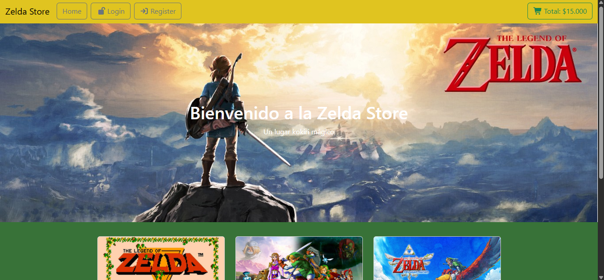

# Zelda Store

Tienda web tematica de The Legend of Zelda, desarrollada con React y Bootstrap como parte de mi practica y proyectos del bootcamp.

## Screenshot

## Descripcion

Zelda Store es una landing page de e-commerce ficticia donde se muestran distintos juegos de la saga Zelda mediante cards con imagen, nombre, caracteristicas y precio. Incluye navegacion superior, seccion principal con header destacado, catalogo de productos y pie de pagina.

## Tecnologias utilizadas

- React
- Vite
- Bootstrap 5
- CSS3
- JavaScript (ES6+)

## Funcionalidades

- Navbar responsive con opciones de navegacion (Home, Login/Register o Logout/Profile segun estado de sesion, y Total de compra)
- Header con imagen destacada y texto de bienvenida
- Catalogo de juegos mediante componente reutilizable CardJuego, con props para imagen, nombre, caracteristicas y precio
- Footer con informacion de derechos reservados
- Formateo de precios con separador de miles